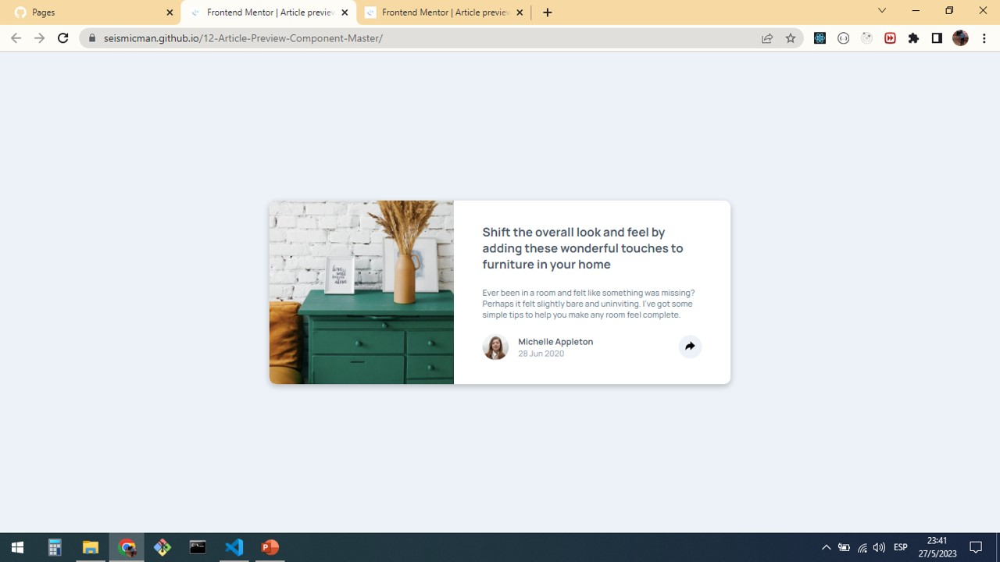
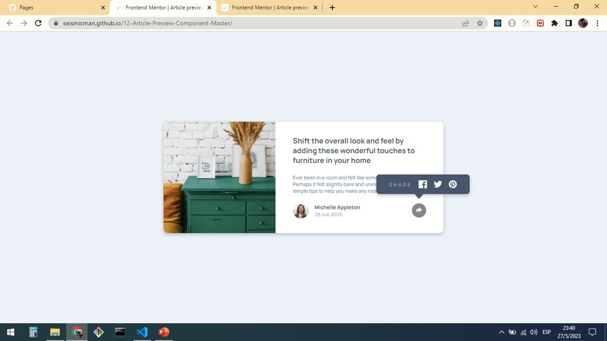

# Frontend Mentor - Article preview component solution

This is a solution to the [Article preview component challenge on Frontend Mentor](https://www.frontendmentor.io/challenges/article-preview-component-dYBN_pYFT). Frontend Mentor challenges help you improve your coding skills by building realistic projects.

## Table of contents

- [Overview](#overview)
  - [Screenshot](#screenshot)
  - [Links](#links)
- [My process](#my-process)
  - [Built with](#built-with)
  - [What I learned](#what-i-learned)
  - [Continued development](#continued-development)
  - [Useful resources](#useful-resources)
- [Author](#author)

## Overview

### Screenshots

### Links

Solution URL: [https://seismicman.github.io/11-Social-Proof-Section-Master/](https://seismicman.github.io/11-Social-Proof-Section-Master/)

## My process

### Built with

- Semantic HTML5 markup
- CSS custom properties
- Flexbox
- [React](https://reactjs.org/) - JS library

### What I learned

This a project that we can mainly develop in HTML and CSS. However, I developed it in React using components and CSS for the styles. It was so important to understand clearly elements positioning in CSS, as well as some CCS properties related as "position (absolute, relative, static)" and "top-right-bottom-left" to locate the elements.

Other important topic was to manage multiples SVG images and to use properties as "filter", "transform", "rotate", "invert", among others

Also, it was very useful to understand Flexbox to organize the different components of the User Interface and the use of media queries to switch between desktop and mobile versions.

It was interesting also, to put my personal approach to the view for max-width of the screen between 600px to 850px.

Regarding the functionality of this challenge in react, I used a component "share" to avoid repeating code and to have a reusable component, and this content in a "Card" component.

### Continued development

I would like to continue developing this challenges using React as main resource and complementing with other ones as HTML5, CSS, SAAS, Bootstrap, Tailwind among others.

### Useful resources

- [https://www.youtube.com/@FaztCode <- To learn about tech for developers](https://www.youtube.com/@FaztCode) - Fun youtube channel where you will find a wide variety of topics about technology for developers. It was very useful for me to deploy my projects on github and github pages.
- [https://jonmircha.com/cursos <- To learn about frontend resources](https://jonmircha.com/cursos) - This is an amazing spanish channel when do you can learn about HTML5, CSS, React, Git and Github, among others. I'd recommend it to anyone still learning about these resources.

## Author

- Frontend Mentor - [@seismicman](https://www.frontendmentor.io/profile/seismicman)
